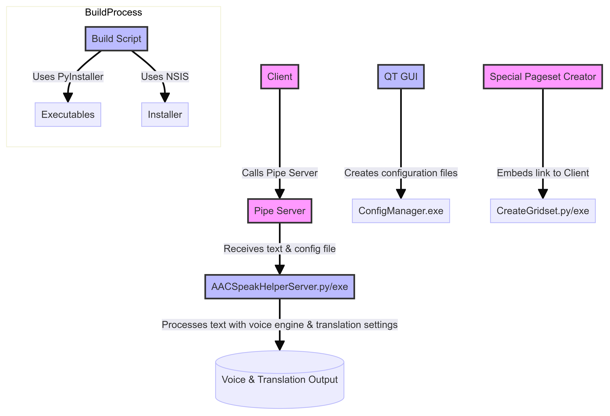

# AAC Online Speak & Translate Plug-in for Windows ("AAC Speak Helper")


## For Full Documentation see here https://docs.acecentre.org.uk/products/v/aac-speak-helper-tool/ 

## Introduction

AAC Speak Helper is designed to enhance your ability to communicate. It leverages the copy-paste clipboard to offer translation services in various languages. It uses multiple providers' Text-to-Speech (TTS) technology to read aloud the translated text. You can easily configure all these functionalities through our Configure app and maintain numerous settings files for different tasks.

## Use Case

Imagine you are a Ukrainian speaker with limited English skills residing in a care facility. AAC Speak Helper bridges you and your caregivers, translating Ukrainian text into English. Moreover, it supports people who need to speak languages less commonly supported by TTS technology.

[](https://www.loom.com/share/dcd185df50224279a0c2630b6ca6b04f)

## Compatibility

AAC Speak Helper is a Windows executable. It can be called from any AAC app on Windows that can run external programs. To make it work you currently need to run the server and client separately - but also edit your pagesets and a speak button. 

## How it Works

AAC Speak Helper reads the text once the text is copied to the clipboard (using Ctrl+C). Depending on the configuration settings, it either translates the text using the selected service, speaks it aloud, or reads it. There are additional features, such as putting intonation (or style) onto some voices. We have a graphical application that can configure the app. The main application, though, has no interface. 

## Developer details

see [this mermaid graph](https://www.mermaidchart.com/raw/bc383b62-6f3e-47de-b168-90786a151ea5?theme=light&version=v0.1&format=svg)



See build details [here](https://github.com/AceCentre/TranslateAndTTS/blob/main/.github/workflows/windows-build-release.yml). 

### To build the encryption key

1. Fill your .env (or github env vars) with the correct keys for google/azure 

eg.
```sh
MICROSOFT_TOKEN="token-here"
MICROSOFT_REGION="uksouth"
GOOGLE_CREDS_JSON="jq -c '@json' ttsandtranslate-7dd2e2d80d42.json - contents here"
MICROSOFT_TOKEN_TRANS="token-for-trans"
CONFIG_ENCRYPTION_KEY="key"
```

To get config encryption key run the following command

```python
from cryptography.fernet import Fernet
print(Fernet.generate_key().decode())
```
2. Once this is all filled up run the following command to encrypt the config file

```sh
uv run python prepare_config_enc.py
```

It will now have a config.enc file created. Our code will use that. If keys are in settings.cfg that overrides these keys


## Prerequisites

1. **Install Python 3.11** (or higher) for Windows from the [official Python website](https://www.python.org/downloads/release/python-31011/).

2. **Install uv** if you don't have it already. You can install uv by running:

    ```sh
    python -m pip install uv
    ```

    Ensure that uv is available in your PATH. You can verify this by running:

    ```sh
    uv --version
    ```

## Setting Up the Development Environment

1. **Clone the Repository** if you haven't already:

    ```sh
    git clone https://github.com/AceCentre/AACSpeakHelper.git
    cd AACSpeakHelper
    ```

2. **Create a Virtual Environment and Install Dependencies**:

    ```sh
    uv venv
    uv sync --all-extras  # Installs all dependencies including dev tools
    ```

    This command will:
    
    - Create a virtual environment in the `.venv` directory within your project.
    - Install all dependencies and development tools listed in `pyproject.toml`.

3. **Activate the Virtual Environment** (if needed):

    While uv handles this automatically with `uv run`, you can activate the virtual environment manually if required:

    ```sh
    .venv/Scripts/activate  # On Windows
    # or
    source .venv/bin/activate  # On Unix-like systems
    ```

## Running the Application

1. **Run the Server**:

    With the virtual environment active, you can run the application directly:

    ```sh
    uv run python AACSpeakHelperServer.py
    ```

    This ensures that the Python interpreter and dependencies used are from the managed environment.
    
    to call the client now you do (in a different terminal/console)


    ```sh
    uv run python client.py
    ```

    And CLI Configuration Tool (for development):

    ```sh
    uv run python cli_config_creator.py
    ```

    Note: The GUI configuration tool has been excluded from builds due to reliability issues. Use the CLI configuration tool instead.

## Configuration

Before using AACSpeakHelper, you need to configure it. There are two main approaches:

### 1. CLI Configuration Tool (Recommended)

For development:
```sh
uv run python cli_config_creator.py
```

For installed versions, use the "Configure AACSpeakHelper CLI" application from your start menu.

The CLI tool provides an interactive menu to:
- Configure TTS engines (Sherpa-ONNX, Azure TTS, Google TTS, etc.)
- Set up translation providers (Google Translator, Microsoft Translator, etc.)
- Configure language pairs and voice settings
- Save and manage multiple configuration files

### 2. Manual Configuration

Edit the `settings.cfg` file directly:
- **Development**: Located in the project root directory
- **Installed**: Located in `%AppData%\Ace Centre\AACSpeakHelper\settings.cfg`

You can also create custom configuration files and use them with:
```sh
uv run python client.py --config path/to/your/settings.cfg
```

### API Keys and Credentials

For cloud-based TTS and translation services, you'll need API keys:
- **Azure TTS**: Requires Azure Speech Services subscription
- **Google TTS**: Requires Google Cloud TTS API credentials
- **Microsoft Translator**: Requires Azure Translator subscription
- **Other services**: See individual provider documentation

Store credentials in your `settings.cfg` file or use environment variables during development.

## Additional Tips

- **Adding Dependencies**: To add new dependencies:

    ```sh
    # Edit pyproject.toml to add dependencies, then run:
    uv sync
    ```

- **Updating Dependencies**: To update all dependencies:

    ```sh
    uv pip compile pyproject.toml -o requirements.txt
    uv sync
    ```

- **Exiting the Virtual Environment**: To exit the virtual environment:

    ```sh
    deactivate
    ```
    


## License

This project is licensed under the MIT License - see the [LICENSE](LICENSE) file for details.

## Acknowledgments

- [Ace Centre](https://acecentre.org.uk/) for funding and supporting this project.
- Will Wade (TTS-Wrapper is heavily dependent on this project. Will converted the MMS models to sherpa-onnx which is used in this project)
- Gavin Henderson and all of the Ace Centre team for their support and feedback.